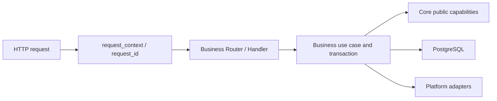

# Backend Requests, Routes and Contracts

Goal: connect your business API to Dougong and verify that requests, database readiness and OpenAPI describe the same application. Complete the [backend quickstart](../getting-started/quickstart.en.md). Run commands from the repository root.

## Get a Result

Start `just dev`, then request the API from another terminal:

```bash
curl --fail-with-body http://127.0.0.1:3000/health/live
curl --fail-with-body http://127.0.0.1:3000/health/ready
curl --fail-with-body http://127.0.0.1:3000/api/v1/system/status
```

Health returns `{"status":"ok"}`; status reads real PostgreSQL migration state. If you start only the API against an empty database, live may succeed while ready must return 503. Run `just migrate` explicitly and check ready again. API startup does not change tables; `just dev` coordinates dependencies and migrations.

## Follow the Request



The [API executable](../../apps/api/src/main.rs) owns settings, pools, telemetry and listening. The [application assembly point](../../apps/api/src/lib.rs) supplies business routes and combined OpenAPI. [Core](../../crates/app/src/lib.rs) exposes this interface; complete wiring is in the assembly point:

```rust
pub fn compose_routes(
    pool: PgPool,
    auth: saas_platform::config::AuthSettings,
    domain_routes: Router,
    document: utoipa::openapi::OpenApi,
) -> Router;
```

Supply your module's Router and OpenAPI from the application; Core does not import your business. Use `compose_routes_with_options` and `CoreOptions` when sharing cache, rate limits, scopes or password-reset configuration.

The [HTTP boundary](../../crates/app/src/http.rs) provides `BoundedJson<T>`, `ApiPath<T>`, `ApiQuery<T>` and common errors. DTOs define protocol, Domain validates rules and Application owns transactions. Start in one file and split responsibilities when complexity warrants it.

## Contracts and Verification

Declare protocol with Handler `utoipa::path` and DTO `ToSchema`, then merge module OpenAPI:

```bash
just generate
pnpm contracts:check
curl --fail-with-body http://127.0.0.1:3000/api/openapi.json
node scripts/test-backend.mjs --test health --test tutorial_module
pnpm tutorial:check
```

The combined contract generates contracts and SDK; clients do not handwrite a second DTO. See the [API reference](site:reference/api.md). Public Router checks cover health/errors and business JSON; the teaching check validates declarations, Router and OpenAPI in a temporary source copy. A route without its contract registration is incomplete.

Readiness has 2 seconds, migrations default to 30 seconds, HTTP drain to 3 seconds and pool closure to 1 second. Locate your code in [project structure](../architecture/project-structure.en.md), then obtain a first response with [adding a backend module](../guides/develop-module.en.md). Protect it with [Identity](02-registration.en.md) and [Sessions](03-sessions.en.md); choose checks using the [feedback loop](../testing/t01-feedback-loop.en.md).
