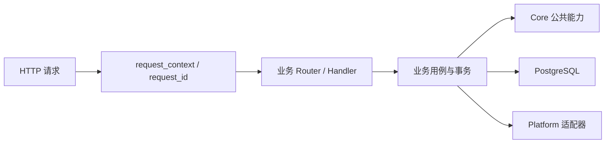

# 后端请求、路由与合同

目标：把自己的业务 API 接入 Dougong，确认请求、数据库 readiness 和 OpenAPI 属于同一份应用。前提是完成[后端快速开始](../getting-started/quickstart.md)；本页命令均在仓库根目录执行。

## 先取得结果

运行 `just dev` 后，在另一个终端请求 API：

```bash
curl --fail-with-body http://127.0.0.1:3000/health/live
curl --fail-with-body http://127.0.0.1:3000/health/ready
curl --fail-with-body http://127.0.0.1:3000/api/v1/system/status
```

健康接口返回 `{"status":"ok"}`；状态接口读取真实 PostgreSQL 迁移版本。只启动 API 时，空数据库的 live 可以成功，ready 必须返回 503。运行 `just migrate` 显式应用迁移，再检查 ready；API 启动不会修改表结构。`just dev` 会编排开发依赖与迁移。

## 请求经过哪里



[API 入口](../../apps/api/src/main.rs)负责配置、连接池、观测和监听；[应用组装点](../../apps/api/src/lib.rs)提供业务 Router 和组合后的 OpenAPI。[Core](../../crates/app/src/lib.rs)实际公开接口如下，完整接线见应用组装点：

```rust
pub fn compose_routes(
    pool: PgPool,
    auth: saas_platform::config::AuthSettings,
    domain_routes: Router,
    document: utoipa::openapi::OpenApi,
) -> Router;
```

自己的模块提供 Router 和 OpenAPI，在应用侧合并；Core 不 import 业务。带缓存、限流、scope 或密码恢复配置时使用 `compose_routes_with_options` 和 `CoreOptions`。

[HTTP 边界](../../crates/app/src/http.rs)提供 `BoundedJson<T>`、`ApiPath<T>`、`ApiQuery<T>` 和统一错误。DTO 描述协议，Domain 校验业务规则，Application 持有事务。小功能可以先放一个文件，复杂后再按责任拆分。

## 合同与验证

在 Handler 的 `utoipa::path` 和 DTO 的 `ToSchema` 中声明协议，并合并模块 OpenAPI：

```bash
just generate
pnpm contracts:check
curl --fail-with-body http://127.0.0.1:3000/api/openapi.json
node scripts/test-backend.mjs --test health --test tutorial_module
pnpm tutorial:check
```

组合合同生成 contracts 和 SDK，客户端不手写第二份 DTO，详见[API 参考](site:reference/api.md)。公开 Router 检查健康/错误和业务 JSON；教学检查在临时源码副本验证声明、Router 与 OpenAPI 接入。增加路由但遗漏合同不算完成。

readiness 查询预算 2 秒，迁移默认 30 秒，HTTP drain 3 秒，连接池关闭最多 1 秒。从[项目结构](../architecture/project-structure.md)定位自己的代码，再按[新增后端模块](../guides/develop-module.md)取得第一个响应。接着使用[Identity](02-registration.md)和[Session](03-sessions.md)保护它；检查选择见[反馈循环](../testing/t01-feedback-loop.md)。
