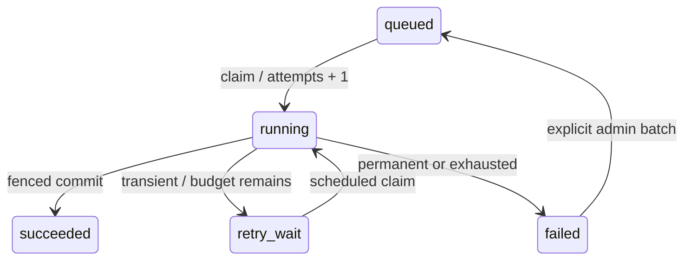

# Worker Leases, Failure Classification and Recovery

Goal: keep finite budgets through crashes, external outages and administrator retries. Implement [Handler/publication transactions](10-document-exports.en.md) first. Jobs coordinates reliable execution; your business still owns external-effect idempotency.

## Claiming Consumes an Attempt

[Core Jobs](../../crates/app/src/modules/jobs/mod.rs) increments attempts, creates a distinct lease_token and records the attempt in the claim transaction. An immediate crash still consumes budget. After expiry another Worker claims only within remaining budget; exhaustion becomes failed.



`JobError::Transient("static.code")` retries with bounded exponential backoff/full jitter; `Permanent` terminates; `LostLease` prevents stale terminal writes. Persist static safe codes, never formatted storage errors, payloads or secrets.

## Fence the Result

`Lease::lock_current(connection)` checks current token, running and valid expiry while locking the row. `succeed(connection)` updates Job, attempt/batch and notification in the caller's transaction. Business result, Audit and succeed commit together. See [actual interfaces](../../crates/app/src/modules/jobs/mod.rs).

After another Worker takes over, the first cannot overwrite results with its old token even after successful I/O. A fence cannot retract sent mail or remote effects; use immutable candidates, unique business constraints or remote idempotency keys.

The [Worker loop](../../crates/app/src/modules/jobs/worker.rs) drives Handler and heartbeat independently, allowing publication to advance while renewal waits for locks. Failed renewal cancels the Handler future/releases its transaction before a bounded failure write. Shutdown stops new claims and drains finitely; timeout leaves the running lease to expire rather than releasing still-active effects early.

Defaults are 60/20/10 seconds for lease/heartbeat/drain; see [configuration](site:reference/config.md). Blocking work needs cooperative cancellation because started `spawn_blocking` cannot be forcibly aborted.

## Reuse Administrator Recovery

[Management API](../../crates/app/src/modules/jobs/management.rs) and [use cases](../../crates/app/src/modules/jobs/administration.rs) require current Owner/Admin. Retrying a failure preserves Job ID, business payload/snapshot and old history while explicitly starting a new finite batch. Idempotency and Audit share the transaction; successful Jobs cannot reopen.

Management responses omit payload and lease_token. List cursors bind identity/status and history is bounded. Retry transient failures after restoring dependencies. Administrator retry does not restore revoked credentials, access or expired snapshots; an eligible user must submit a new request.

## Verify Controlled Failures

Run from the repository root:

```bash
node scripts/test-backend.mjs --test jobs
```

<!-- example:knowledge:reference-01:start -->

```bash
node scripts/test-backend.mjs --test exports
```

<!-- example:knowledge:reference-01:end -->

[Public Jobs checks](../../crates/app/tests/jobs.rs) cover crash budgets, takeover, stale rejection, bounded shutdown and backoff. [Management checks](../../apps/api/tests/jobs.rs) cover authorization, batches/history, idempotency and Audit rollback. Real locks/synchronization organize races, while database timestamps establish time boundaries without random sleeps.

Add a lost-lease publication check to your Handler and classify permanent/transient errors. Continue with [business deletion/cleanup](12-deletion-cleanup.en.md); registered [notifications](13-export-notifications.en.md) publish in terminal transactions.
