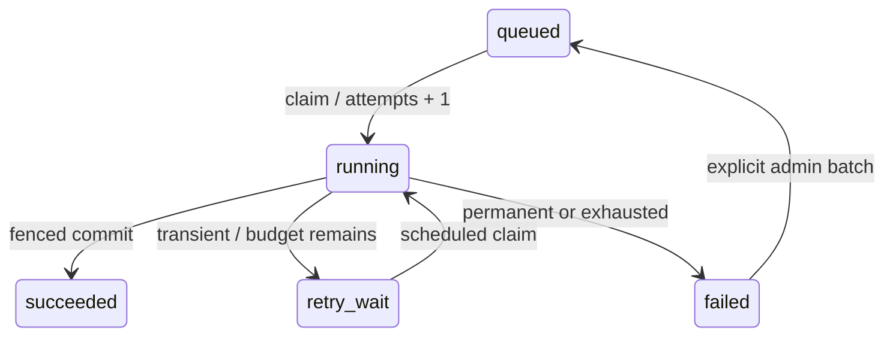

# Worker 租约、失败分类与恢复

目标：让自己的后台任务在进程崩溃、外部服务故障和管理员重试后仍遵守有限预算。前提是实现了[Handler 与发布事务](10-document-exports.md)；Jobs 提供可靠执行协调，外部副作用仍需业务幂等。

## 领取也消耗一次尝试

[Core Jobs](../../crates/app/src/modules/jobs/mod.rs)在领取事务增加 attempts、生成独立 lease_token 并记录 attempt。领取后立刻崩溃也消耗预算；租约到期后，其他 Worker 只能在剩余预算内重新领取。预算耗尽转 failed，不无限重领。



`JobError::Transient("static.code")` 有界退避重试，采用指数退避/full jitter；`Permanent` 进入失败终态；`LostLease` 不允许旧执行者写终态。只保存静态安全码，不格式化存储错误、payload 或秘密到摘要。

## fence 保护结果

`Lease::lock_current(connection)` 要求当前 token、running、期限有效并取行锁；`succeed(connection)` 在调用者事务更新 Job、attempt/batch 和通知。业务结果、Audit、succeed 同事务提交。签名见[源码](../../crates/app/src/modules/jobs/mod.rs)。

第二个 Worker 接手后，第一个即使完成 I/O 也不能用旧 token 覆盖结果。fence 不能撤销已经发送的邮件或远端动作；使用不可覆盖候选、业务唯一约束或服务端幂等键控制副作用。

[Worker 循环](../../crates/app/src/modules/jobs/worker.rs)独立驱动 Handler 和 heartbeat；续租 SQL 等待发布锁时 Handler 仍推进。续租失败先取消 Handler future、释放事务，再有界写失败。关停停止新领取并有限 drain，超时保留 running 租约等待到期，不提前释放仍执行副作用的任务。

默认 lease/heartbeat/drain 为 60/20/10 秒，配置见[参考](site:reference/config.md)。阻塞工作仍需协作取消，`spawn_blocking` 开始后不能强制中止。

## 复用管理员恢复

[管理 API](../../crates/app/src/modules/jobs/management.rs)和[用例](../../crates/app/src/modules/jobs/administration.rs)只允许当前 Owner/Admin 查询或重试。失败重试保留 Job ID、业务 payload/快照，显式开启新的有限 batch，旧历史不删除；幂等命令和 Audit 同事务，成功任务不能重开。

管理响应不返回 payload 或 lease_token。列表 cursor 绑定身份/状态，详情有界加载历史。恢复外部服务后可以重试临时失败；原凭据撤销、资源失权或快照过期不会因管理员重试恢复，应由合法用户新申请。

## 可控故障验证

仓库根目录执行：

```bash
node scripts/test-backend.mjs --test jobs
```

<!-- example:knowledge:reference-01:start -->

```bash
node scripts/test-backend.mjs --test exports
```

<!-- example:knowledge:reference-01:end -->

[公开 Jobs 测试](../../crates/app/tests/jobs.rs)验证崩溃次数、租约接替、旧结果拒绝、有限关停和退避；[管理测试](../../apps/api/tests/jobs.rs)验证权限、新 batch、历史、幂等和审计回滚。竞态用真实锁与同步点，时间边界推进数据库时间戳，不靠随机 sleep。

自己的 Handler 增加“领取后失去租约仍不能发布”的检查，再定义永久/临时错误分类。下一步接入[业务删除与清理](12-deletion-cleanup.md)；已登记的通知由[终态事务](13-export-notifications.md)发布。
